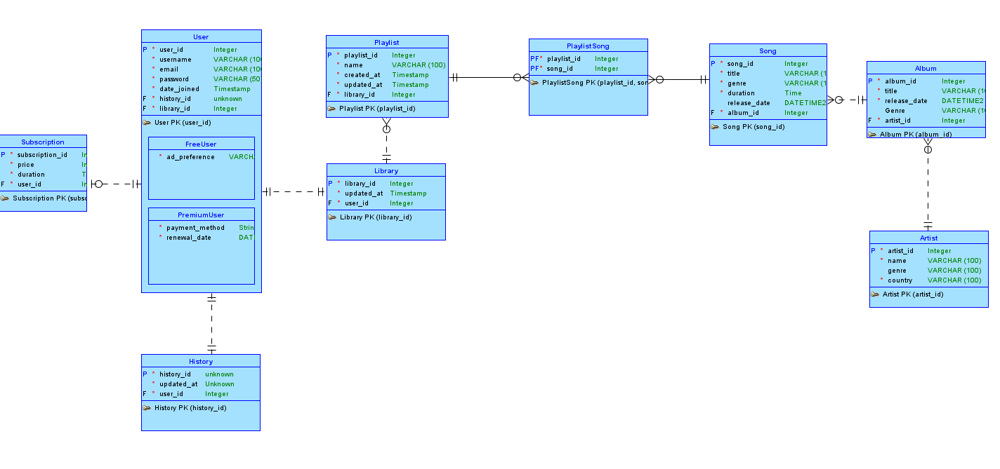
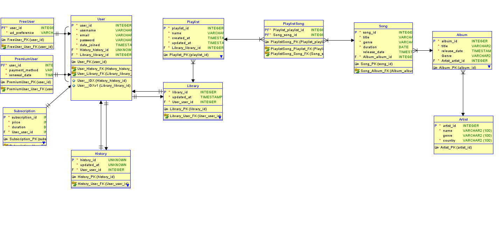

# Music Streaming Service – Database Design Project

This project presents a full relational database design for a music streaming service platform. It includes an Entity-Relationship Diagram (ERD), business rules, normalization, and SQL DDL scripts implemented in Oracle. The system supports both free and premium users, music libraries, playlists, listening history, and artist/album/song management.

---

## 📌 Project Summary

The platform is designed to allow users to discover, stream, and organize music. It supports:
- **Free plan**: ad-supported access
- **Premium plan**: paid ad-free access with high-quality audio

Users can maintain personal libraries and playlists, access a wide collection of songs and albums, and track interactions like plays and modifications via listening history.

---

## 🧩 Entity Relationship Model

- **User**: Can be a `FreeUser` or `PremiumUser` (XOR arc subtype)
- **Library**: Each user owns one; contains playlists
- **Playlist**: Belongs to one library, contains many songs
- **Song**: Part of one album, can appear in multiple playlists
- **Album**: Linked to one artist
- **Artist**: Can have multiple albums
- **History**: Tracks user actions (1:1 with user)
- **Subscription**: Optional but linked to user
- **UserSong** and **PlaylistSong**: M:N resolving entities
- **Referrer (Recursive Relationship)**: A user can refer another user (self-referencing)

---

## 📐 Business Rules

- Each `User` must have a `Library` and a `History`
- A `User` is either a `FreeUser` or a `PremiumUser`, not both
- A `Library` may have many `Playlists`
- A `Playlist` can contain multiple `Songs` (via `PlaylistSong`)
- A `Song` belongs to one `Album`
- An `Album` is created by one `Artist`
- Each `User` may refer another user (1:M recursive)

---

## 🛠 DDL Implementation (Oracle)

The project is fully implemented in Oracle SQL Developer. Key features:

- Primary and foreign key constraints
- Index creation for performance
- Intersection tables for M:N relationships
- Subtypes managed via foreign key inheritance
- Normalized table structures

---

## 🔄 CRUD Capabilities

Example queries implemented:
- Retrieve all songs from a specific album
- Find the longest song in each genre
- Count number of songs per genre
- List albums with their songs and total play time
- Average duration and most recent release by genre
- Song duration variability analysis

---

## 📸 Diagrams

### Logical ER Diagram

### Relational Schema Diagram

---

## 🧬 Tables Overview

| Table          | Description                            |
|----------------|----------------------------------------|
| `User`         | General user data                      |
| `FreeUser`     | Subtype with ad preferences            |
| `PremiumUser`  | Subtype with payment info              |
| `Library`      | Collection of playlists for a user     |
| `Playlist`     | User-created playlists                 |
| `PlaylistSong` | M:N resolver between Playlist and Song |
| `Song`         | Individual music tracks                |
| `Album`        | Contains one or more songs             |
| `Artist`       | Music creators                         |
| `History`      | Logs user interaction with the app     |
| `Subscription` | User subscription details              |

---

## 📬 Author

Luka Trunić

---

